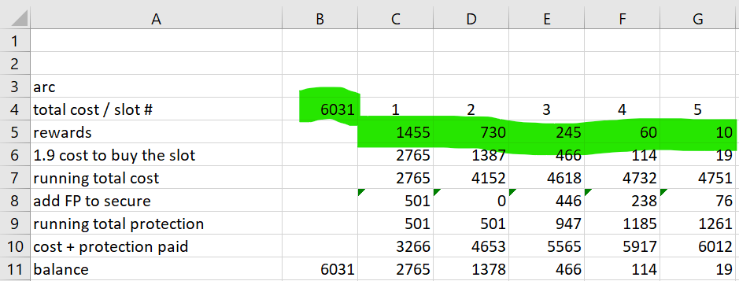
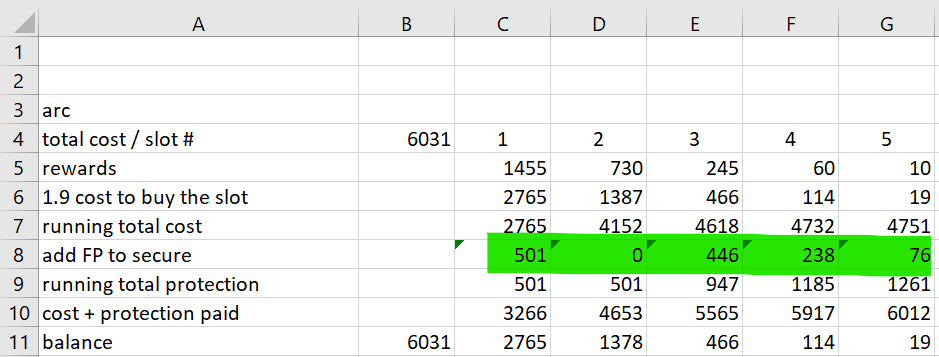
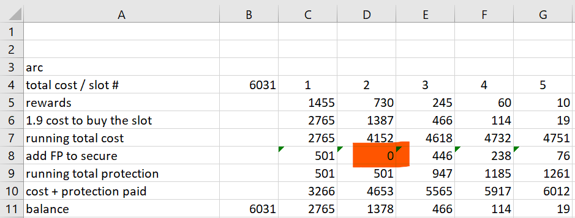
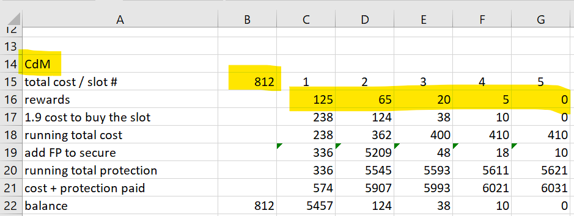
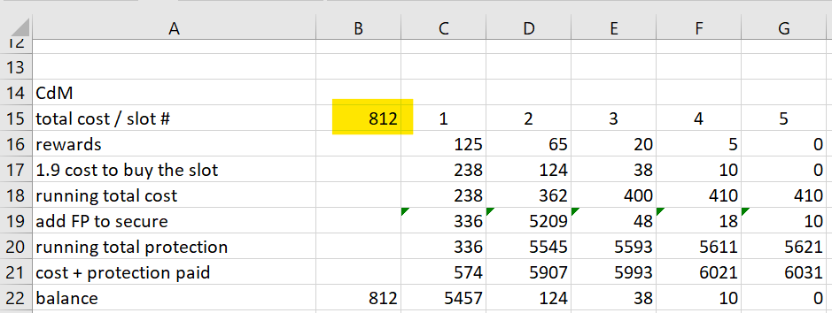
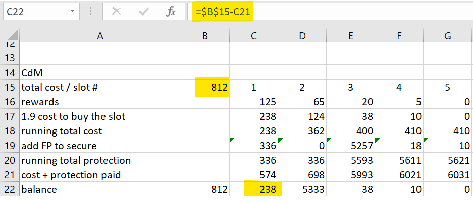

# ForgeGBCalculator
Calculates Forge of Empire Great Building levels for 1.9 threads

There are two things you need to know about this spreadsheet:
1. How to use it
2. How to add another building

## How to use it

### You just leveled your building and unlocked the next level  
1. Put the total FP to level in cell B4.
2. Put the FP rewards for each slot in cells C5-G5.  

3. The spreadsheet shows how many FP you need to secure each level in cells C8-G8.  

4. If it says 0, the level is snipable, so fill it fast.  

### You are adding FPs to your building
1. The spreadsheet assumes each level is filled by another player in order.
2. It doesn't work if they're filled out of order. 
3. It doesn't work if a level is sniped.
4. Add the FP in the "add FP to secure" row to your building.
5. Put the newly-secured level in the 1.9 thread.
6. Profit.
 
## How to add another building

This isn't very easy to do with the Excel mobile app. PC is best.  

1. Copy/paste all of the populated cells
2. Configure it just like you would a new level (as documented above)  

(Notice the pretty crazy numbers in the last few rows. We're about to fix that.)  
3. IMPORTANT: last step - do this only once when you're adding a building:

The forumulas in the "balance" row need to be updated. If you look at the formula in cell C11, you'll see:  
=$B$4-C10  
It means subtract the "cost+protection paid" value for the slot from the total FPs to level in cell B4.  

In the new building's "balance" row, change the formulas for all slots so they refer to the `total FPs to level` for that new building.  
In the example, total FPs to level for the CdM is cell B15.  
  
So for each of cells C22 to G22, change the formulas from "=$B$4-x21" to "=$B$15-x21".  
  

In the example, this means:  
Change C22 to "=$B$15-C21"  
Change D22 to "=$B$15-D21"  
Change E22 to "=$B$15-E21"  
and so on.